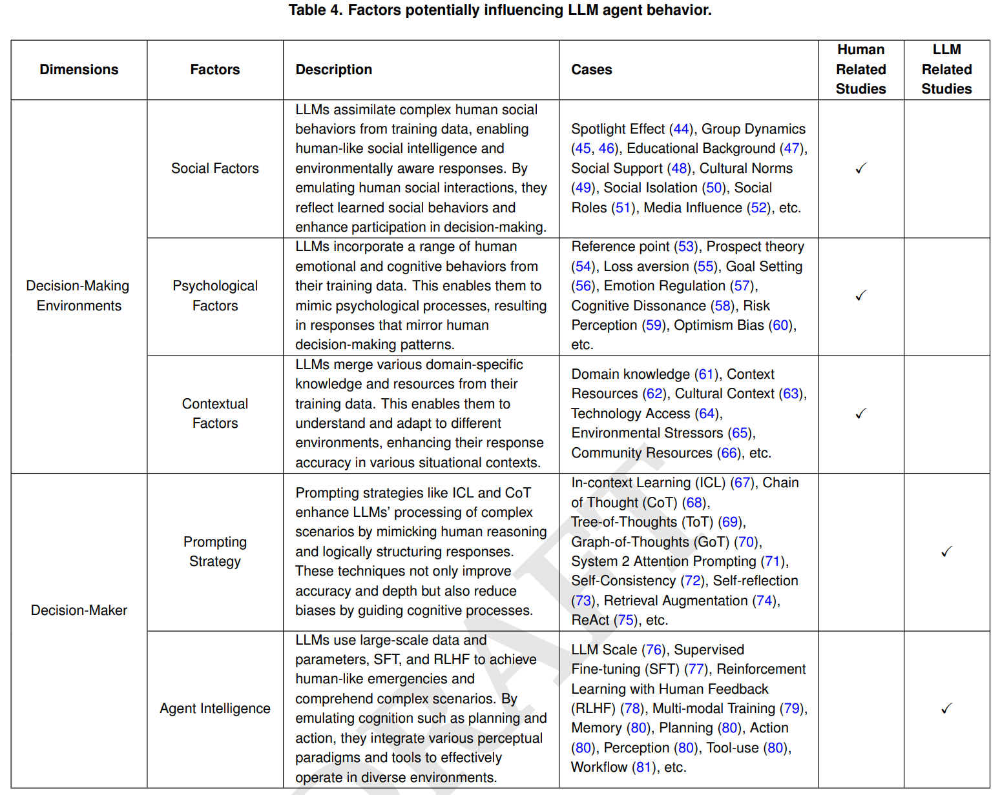

# Machine Behaviorism

This repository contains the source code and results for the PNAS submission titled **"Machine Behaviorism: Exploring the Behavioral Dynamics of Large Language Models in Decision-Making"**. The project is organized into different phases, with corresponding code and results that can be easily cross-referenced.

## Table of Contents
- [Phase 1: Observation](#phase-1-observation)
- [Phase 2: Explanation & Postulation](#phase-2-explanation--postulation)
- [Phase 3: Intervention](#phase-3-intervention)
- [Dataset](#dataset)
- [Repository Structure](#repository-structure)

## Phase 1: Observation

### Overview
The first phase, **Observation**, involves collecting and analyzing data to observe the behavior of agents influenced by large language models in decision-making tasks. The results from this phase provide baseline metrics for comparison in later phases.

### Folder Structure
- **Observation_Codes**: Contains all the scripts and configurations used to run the observation experiments.
- **Observation_Results**: Contains the output files and results from the observation phase.

### Additional Tools
- **Oberservation_disposition_effect_calculation.ipynb**: This Jupyter notebook is used to calculate the experimental results for the Observation phase. It processes the data and generates the key metrics for analysis.

### Correspondence
Each experiment's code in `Observation_Codes` directly corresponds to its results in `Observation_Results`. For example, the script used for analyzing the dataset `csi100_gpt-3.5-baseline_monthly_2014-2015` will have its results stored in a similarly named file or directory within `Observation_Results`.

## Phase 2: Explanation & Postulation

### Overview
The **Explanation & Postulation** phase builds on the observations to hypothesize underlying mechanisms and formulate postulates about the behavior of large language models in decision-making environments.


### Visualization
Below is the image summarizing the factors influencing LLM agent behavior:



### Description
This phase synthesizes findings from the observation phase to build a conceptual framework that explains the observed behaviors. It serves as a theoretical bridge to the intervention phase, where these postulates are tested.


## Phase 3: Intervention

### Overview
In the **Intervention** phase, we implement strategies and test the impact of interventions based on the observations and postulations made in the earlier phases. The goal is to see how altering certain variables affects the behavior observed in Phase 1.

### Folder Structure
- **Intervention_Codes**: Contains all the scripts and configurations used to implement and run the interventions.
- **Intervention_Results**: Contains the output files and results from the intervention experiments.

### Additional Tools
- **Intervention_disposition_effect_calculation.ipynb**: This Jupyter notebook is used to calculate the experimental results for the Intervention phase. It generates the key metrics for analysis.
- **Intervention_disposition_effect_visualization.py**: A script used for visualizing the results of the intervention phase, creating charts and graphs for better understanding the outcomes.

### Correspondence
Similar to Phase 1, the code in `Intervention_Codes` has a direct correspondence with the results in `Intervention_Results`.

## Dataset

### Overview
The **Dataset** folder contains the raw data used throughout the experiments.

### Folder Structure
- **csi_100_stocks**: Contains stock data related to CSI 100.
- **sp_100_stocks**: Contains stock data related to S&P 100.

These datasets are utilized in both the observation and intervention phases to simulate and analyze the decision-making behaviors influenced by large language models.

## Repository Structure

```plaintext
- Dataset/
  - csi_100_stocks/
  - sp_100_stocks/
- Explanation_Postulation/
  - Explanation_Postulation.png
- Intervention/
  - Intervention_Codes/
    - Intervention_disposition_effect_visualization.py
  - Intervention_Results/
    - Intervention_disposition_effect_calculation.ipynb
- Observation/
  - Observation_Codes/
  - Observation_Results/
    - Oberservation_disposition_effect_calculation.ipynb
- .gitattributes
- README.md
